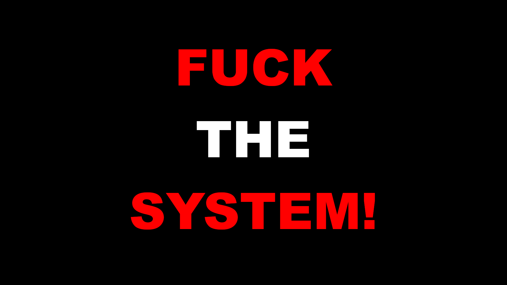

# 1r1s.github.io

## One of Marisa Marion Mackenzie's Websites.

### Blog

#### 2025-08-08: FUCK THE SYSTEM! A very emotional, vulnerable, and personal story about some of the countless forms of abuse, neglect, and harm I've faced in my lifetime.

I've stayed mostly silent on this for a long time, but given that the Human Rights Tribunal of Ontario (HRTO) hasn't assigned me a hearing date for my case after nearly two years, and the police and the court systems are actively breathing down my neck waiting to strike, I'm going to share one of my government horror stories, and why I often say "fuck the system".

I spent 362 days, from November 24th, 2022 to November 21st, 2023, in solitary confinement in Ontario provincial jail because I am trans. Previously, I had spent 260 days in solitary confinement for being trans. Before that, it was 180 days in solitary confinement for being trans. And so on. These were all my entire custodial sentences, not a single day was held anywhere other than solitary confinement. On all of my stays in solitary confinement over the years, the jail guards, jail management, and jail medical staff: physically and sexually assaulted me on numerous occasions, taunted me, would come to my cell door on solitary and call me slurs and threaten to kill me in graphic detail almost every day (which slurs and death threats combined is classified as a hate crime), would gaslight me and lie to me about my placement on solitary confinement and the inhumane conditions and treatment I was facing, and would gaslight and lie to the various oversight bodies that were called in but were unable to intervene (for example, the Ontario Ombudsman, the Canadian Association of Elizabeth Fry Societies [CAEFS] Provincial Advocacy Team, the Client Conflict Resolution Line [CCRL], and so on), and on several occasions nearly murdered me in cold blood. Just like they had described in their death threats. It's a goddamn miracle I'm alive.

When I managed to report one of the assaults to the police, the police didn't lay charges because there was no video footage in the cell I was being held in to prove that I was assaulted and the jail of course simply denied they assaulted me, meaning there was no grounds for charges to be laid. (as always, ACAB)

When I managed to contact the Human Rights Legal Support Centre of Ontario (HRLSC), they needed to contact the jail I was being held in to book a call with a human rights lawyer. On three different occasions within the 362 day stay, as soon as the HRLSC contacted the jail I was suddenly transferred to a different jail the next day, so the HRLSC had no idea where to find me or how to contact me.

When the CAEFS Provincial Advocacy Team was scheduled to attend the jail I was being held in the next day, as they do twice yearly for every provincial jail in Ontario, to talk to every single inmate one by one about the jail conditions for a bi-yearly report, I was suddenly transferred to a different jail that wasn't scheduled for interviews. When I managed to relay a message to someone on the CAEFS Provincial Advocacy Team to inform them of my transfer, and that team member asked the jail management about it, jail management responded with "Oh, that doesn't happen. We don't transfer females to other jails. They stay here." In short, jail management lied and gaslit, as they had many times before.

The jails claimed I wasn't being held on solitary confinement, but that I was being single-celled on a "specialized care unit", despite these "specialized care units" being literally unchanged other than in name from solitary confinement units. During one of the jail guards regularly scheduled taunting and issuing of death threats sessions, I summoned the courage to ask: "What specialized care do I receive here?" His answer: "The specialized care you receive is that you're alive. We can take that away at any time." Alive. The bare minimum. That was literally all I got.

They claimed at one point that since I was offered to be moved to either a "yard" (a 9 by 5 concrete box with a tiny, fenced off portion of the sky revealed) or a "day room" (a 9 by 5 concrete box with a television, wow!) by myself for two hours every other day, that I wasn't on solitary confinement. No human interaction beyond the 15 seconds of jail guards moving me to essentially a different cell and back but refusing to actually interact with me. Either way, solitary confinement is defined as 22 hours or more a day with no human interaction. Prolonged periods of solitary confinement lasting more than 15 days is defined as a form of torture. So I was facing the torture of solitary confinement combined with the torture of physical, sexual, psychological and emotional abuse.

I will remind you that the only reason they gave me for all this is that I'm trans. As soon as I filed a Human Rights Tribunal application against the Ontario Ministry of the Solicitor General (who runs the jails in Ontario), their lawyer immediately tried to claim it was about everything but my transness, and denied that any of my experiences actually happened, because of course their lawyer denied it and lied and gaslit me some more, I'm not surprised.

I often say "fuck the system!", for many reasons, from medical system abuse and neglect, to police abuse and neglect, to government abuse and neglect, to the court system abuse and neglect, to abuse and neglect from those I've met in my personal life, and the many other sources of abuse and neglect I've faced.

They've tried many times to silence me. They've tried many times to gaslight me. They've tried many times to murder me. They've tried many times to shame me. They've tried many times to make me disappear without a trace. They've tried many times to do a lot of terrible things to me. But I'm still here. And I'm not planning on going anywhere...that's as if it were my choice to make. When it comes to the government and it's various systems and all the power it holds, "getting disappeared" (I sometimes refer to it as "getting Hocus Pocus'd") or not isn't a choice that I get to make, now is it?

FUCK THE SYSTEM!

Until next time folks (hopefully there's a next time!), take care.

Sincerely,
Marisa
2025-08-08

